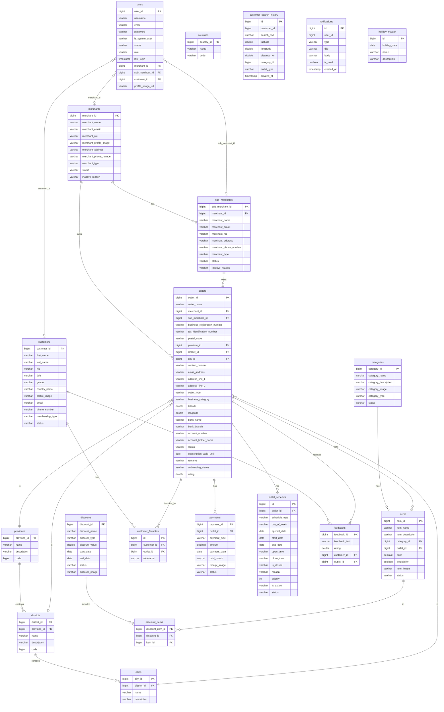

# Find It – Entity Relationship Diagram

This document describes the database schema for the Find It backend as an ER diagram. The diagram is defined in Mermaid format and can be rendered in GitHub, VS Code (with a Mermaid extension), or [mermaid.live](https://mermaid.live).

A simplified visual overview is available at [`../assets/findit-er-diagram.png`](../assets/findit-er-diagram.png).

## Mermaid ER Diagram

## Entity summary

| Table | Description |
|-------|-------------|
| **users** | System users (admin, merchant, sub-merchant, customer); links via merchant_id, sub_merchant_id, or customer_id |
| **customers** | End customers (profile, membership, contact) |
| **merchants** | Main merchants (business info, type, status) |
| **sub_merchants** | Sub-merchants under a merchant |
| **outlets** | Physical/store outlets (location, bank, subscription, onboarding) |
| **countries** | Country lookup (not linked by FK in entities; used in customer.country_name) |
| **provinces** | Province lookup |
| **districts** | District lookup (belongs to province) |
| **cities** | City lookup (belongs to district) |
| **categories** | Product/service categories |
| **items** | Items sold by an outlet (linked to category and outlet) |
| **discounts** | Discount definitions (type, value, dates) |
| **discount_items** | Many-to-many: which items get which discount |
| **customer_favorites** | Customer–outlet favorites (with optional nickname) |
| **customer_search_history** | Search history (customer_id, search_text, filters, created_at) |
| **notifications** | User notifications (user_id, type, title, body, is_read) |
| **payments** | Payments linked to an outlet |
| **outlet_schedule** | Opening hours / schedule per outlet (normal, temporary, emergency) |
| **holiday_master** | Holiday dates (used for closure logic) |
| **feedbacks** | Customer feedback and rating for outlets |

## Relationship summary

- **Merchant → SubMerchant**: One-to-many (merchant has many sub-merchants).
- **Merchant / SubMerchant → Outlet**: Outlets belong to either a merchant or a sub-merchant.
- **Province → District → City**: Hierarchy for location (provinces contain districts, districts contain cities).
- **Outlet**: References province, district, city; has many items, payments, schedules, feedbacks, and customer favorites.
- **Category → Item**: One-to-many; each item has one category.
- **Outlet → Item**: One-to-many; each item belongs to one outlet.
- **Discount ↔ Item**: Many-to-many via **discount_items**.
- **Customer ↔ Outlet**: Many-to-many via **customer_favorites** (favorites).
- **Customer → Feedback**, **Outlet → Feedback**: Customers give feedback for outlets.
- **User**: Logical links to merchant, sub_merchant, or customer via IDs (no JPA relations in entity).

## Abstract entity (audit fields)

Most entities extend `AbstractEntity`, which adds:

- `created_by`, `created_datetime`
- `modified_by`, `modified_datetime`
- `version` (optimistic locking)

These columns exist on the corresponding tables but are omitted from the diagram for clarity.
